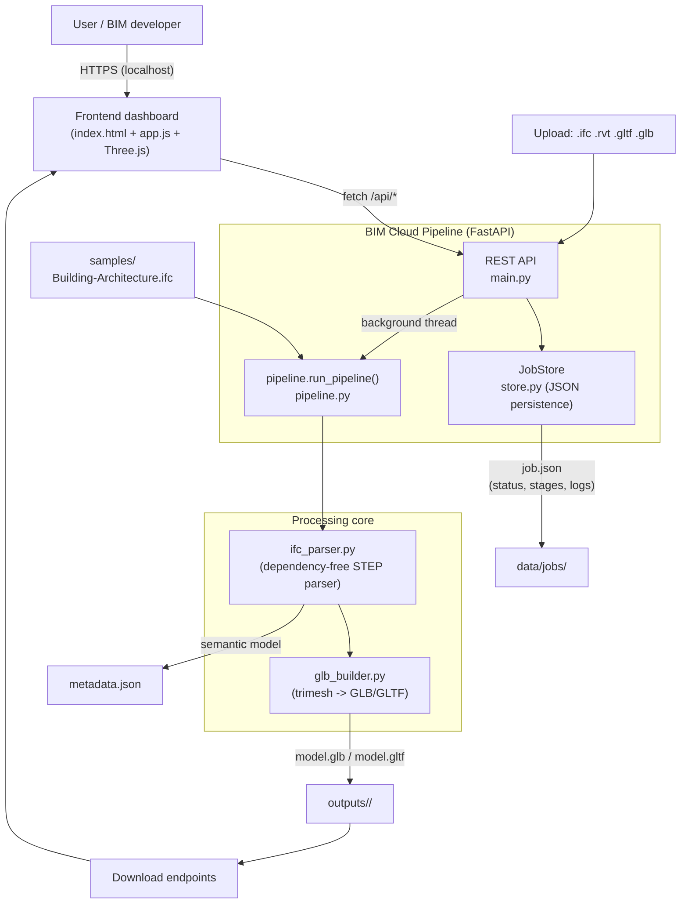
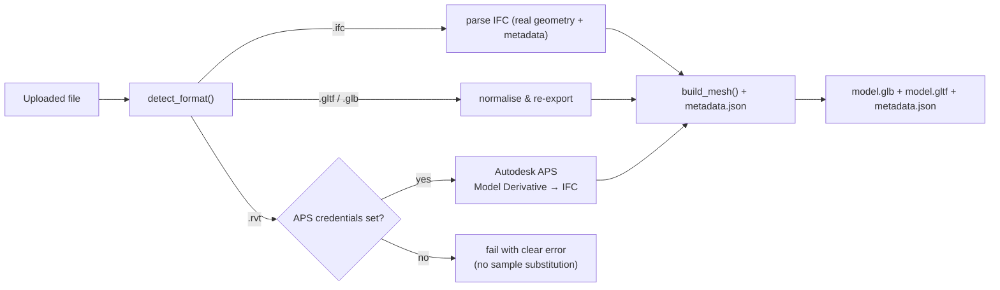

# Architecture — BIM Cloud Pipeline

## System overview



## Format routing



## ASCII data flow

```
 file ──► POST /api/jobs ──► JobStore.create() ──► background thread
                                                    │
                                                    ▼
                                        pipeline.run_pipeline()
                                          ├─ uploaded    (log)
                                          ├─ validated   (format detect)
                                          ├─ parsed      (ifc_parser.extract_model)
                                          ├─ geometry    (glb_builder.build_mesh)
                                          ├─ optimized   (export .glb / .gltf)
                                          └─ metadata    (write metadata.json)
                                                    │
                                                    ▼
                                     outputs/<job>/model.glb
                                     outputs/<job>/model.gltf (+.bin)
                                     outputs/<job>/metadata.json
                                                    │
                                                    ▼
                          GET /api/jobs/{id}/download/{file} ──► user
```

## Components

| Component | File | Responsibility | Dependencies |
|-----------|------|----------------|--------------|
| REST API | `backend/main.py` | Upload, job CRUD, downloads, static dashboard | fastapi, uvicorn |
| Job store | `backend/store.py` | In-memory registry + JSON persistence | stdlib |
| Pipeline | `backend/pipeline.py` | Staged, logged processing + format routing | trimesh |
| IFC parser | `backend/ifc_parser.py` | STEP tokenizer → entities → semantic model (geometry + metadata) | none |
| GLB builder | `backend/glb_builder.py` | mm→m conversion, per-element vertex colours, GLB/GLTF export | trimesh, numpy |
| Dashboard | `frontend/` | Upload UI, live job tracking, Three.js GLB viewer, metadata/API tabs | Three.js (CDN) |

## Key design decisions

1. **No BIM runtime dependency.** IFC parsing is done with a purpose-built STEP
   parser, so the pipeline runs anywhere Python runs — no Revit, no Autodesk
   account, no IFC engine to install.
2. **Two outputs, one pipeline.** The same parse produces both the optimised
   mesh (GLB/GLTF) and the structured metadata (JSON), so geometry and semantics
   stay consistent.
3. **Async jobs with live progress.** Processing runs in a background thread;
   the store records stages and logs that the dashboard polls.
4. **Format-routed processing.** `.ifc` is parsed natively; `.gltf/.glb` is
   normalised; `.rvt` routes to the APS adapter (or fails clearly without credentials).
5. **Faithful units.** IFC millimetres are converted to metres (glTF standard)
   so outputs drop straight into AR/VR and web viewers.

## Extension points (now implemented)

- **Autodesk APS adapter** - *implemented + unit-tested (mocked)*
  (`backend/aps_adapter.py`). Real `.rvt` conversion via APS Model Derivative:
  OAuth → bucket → translate to **IFC** → download the IFC derivative → feed it
  through the native IFC parser. Activates when `APS_CLIENT_ID` /
  `APS_CLIENT_SECRET` are set. *Not live-validated* (requires a live APS account).
- **Cloud storage** - *implemented + unit-tested (mocked)* (`backend/storage.py`).
  `S3Storage` uploads outputs and returns presigned URLs when AWS credentials +
  `AWS_S3_BUCKET` are set; `LocalStorage` is the default.
- **Compare view** - *implemented*. `GET /api/compare/{idA}/{idB}` diffs two
  models (`backend/compare.py`) and the dashboard renders side-by-side viewers
  plus a metadata diff table.
- **Public demo mode** - *implemented*. `PUBLIC_DEMO_MODE=1` (on by default on
  hosted platforms) scopes job history per visitor, shows the confidential-data
  warning, and keeps uploads ENABLED (bounded by limits + TTL cleanup).
  `DISABLE_UPLOADS=1` switches to samples-only mode.
